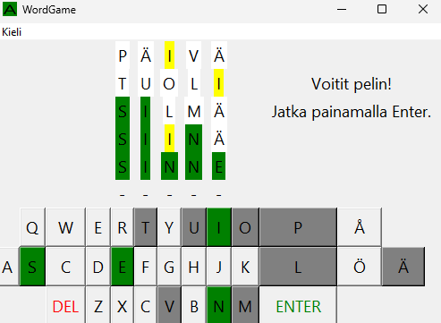
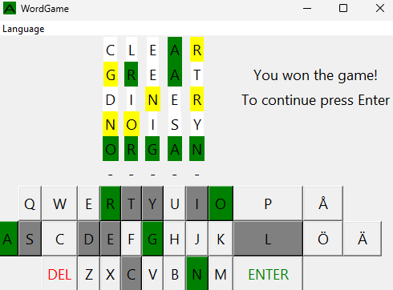

# WordGame
Plays just like the viral copyrighted word game on that one popular American news site!
Created for the Ohjelmointi 1 (Programming 1) -course as the final project. The theme was GUI.

# Features:
- Supports both Finnish and English in both gameplay as well as in the UI.
- There up to 5757 different possible words in English and 3286 in Finnish.
- Supports keyboard as well as the in-game UI for input.




# Installation
[Python 3](https://www.python.org/downloads/) is needed

Download the code from the repository and launch a terminal. Then navigate to the folder where you have installed the code.

After that type:

```
pip install -r requirements.txt
```

Once it's installed launch the WordGame.py from the terminal:

```
python WordGame.py
```

